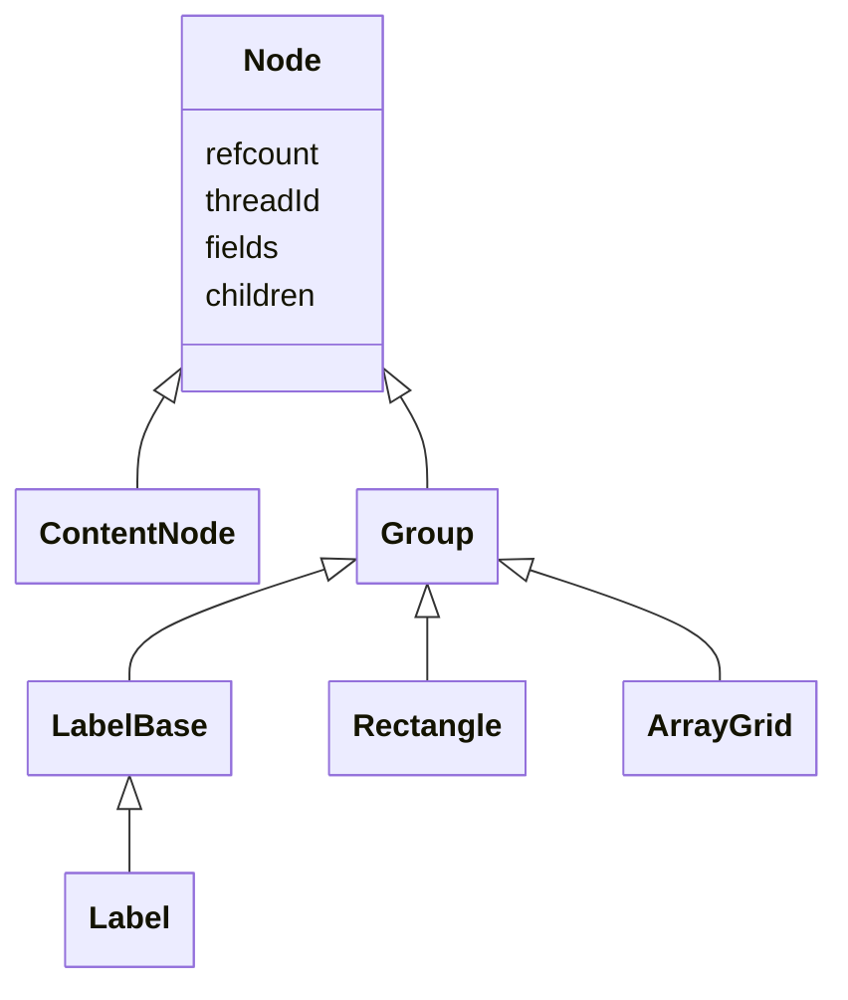
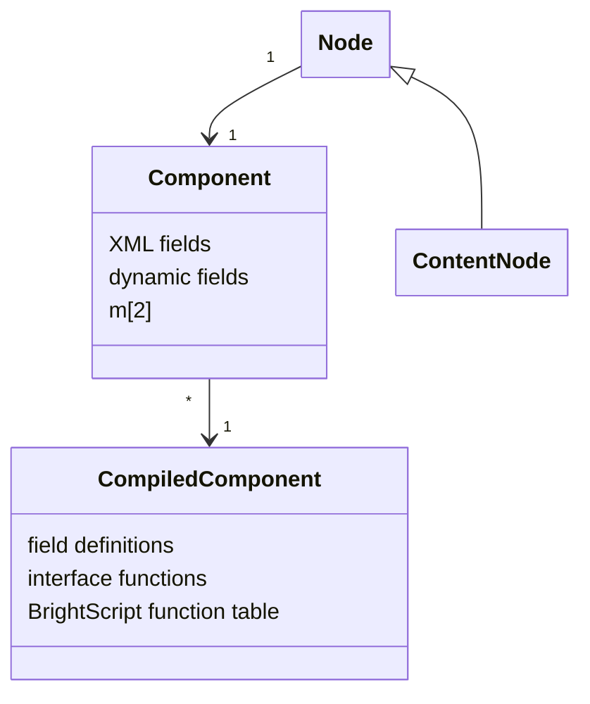
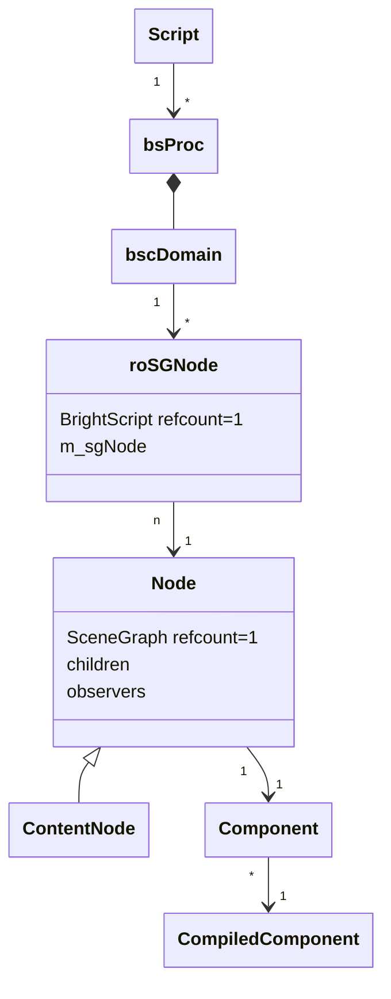
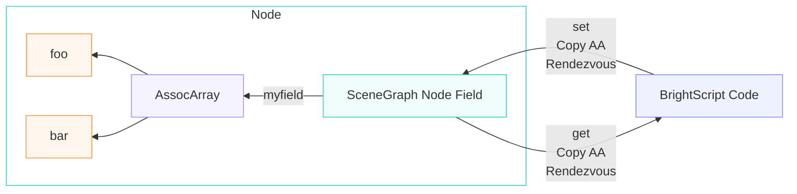
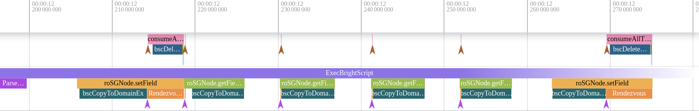
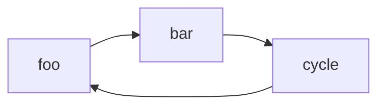

```
title: "BrightScript access to SceneGraph Nodes - Performance Considerations"
excerpt: "Performance considerations of SceneGraph nodes, BrightScript and fields."
deprecated: false
hidden: false
metadata:
  title: "BrightScript-to-SceneGraph bindings | Roku Developer Docs"
  description: "Performance and memory costs of SceneGraph node fields, BrightScript copying, observers, and thread communication."
  robots: index
next:
  description: ''
```

# SceneGraph, Performance & Memory - A Rough Guide

SceneGraph is built around a tree of _nodes_ which are then rendered onto the display. BrightScript can
manipulate these nodes. The built-in node classes can be extended by developers by defining
_component classes_.

This document discusses some of the details of this, and their impact
on the performance and memory usage of a BrightScript/SceneGraph channel.

## SceneGraph Nodes

SceneGraph nodes are built upon a base C++ `Node` class (e.g. `Group`, `ContentNode`). `Node`s can have children
and can also reference other nodes through fields. These nodes are reference-counted in C++ via `std::shared_ptr`
and live independently of BrightScript. They are released when their reference count drops to zero.



### Thread Ownership

The `threadId` is used to track "ownership" - which thread (task/SDK1 or render thread) "owns" this
node. If a non-render thread accesses a node owned by the render thread, it will _rendezvous_ the
operation. It is never possible for the render thread to encounter a node it does not own - the
APIs _transfer_ the ownership recursively over to the render thread first.

This is the mechanism that ensures a task thread cannot access a node concurrently with the render
thread - after a task thread passes a node over to the render thread its ownership changes and
thereafter all operations by the task thread are rendezvoused over to the render thread - the task thread
blocks while the render thread performs the operation on its behalf (get/set/callfunc, etc).

## SceneGraph Components

SceneGraph's base C++ components can be extended using SceneGraph's XML markup:

```
<component name="MyComponent" extends="ContentNode">
```

This creates an internal `CompiledComponent` object which records:

- The parent compiled component (e.g. when one compiled component extends another).
- The list of field definitions.
- The set of interface functions.
- The set of functions used by this component (e.g. `init`), used for the namespacing support.

When a component node is created (`CreateObject("roSGNode", "MyContentNode")`), this results in the creation of:

- The base C++ node object (e.g. `ContentNode`).
- A `Component` instance, which references the `CompiledComponent`. This is referenced by the node.
- The individual fields, with values set to initial values defined in the `CompiledComponent`.
- The Component `m` array (`m.foo = some_value`).

i.e. a "component" is a SceneGraph `Node` with an associated `Component` data structure
which extends the derived-`Node`'s behavior (refcounting, ownership, etc).
The words "component", "node", and "component node" are often used interchangeably
but as far as programming from BrightScript is concerned, all classes of "component"
are actually "nodes" with extended user-defined fields and functions and have
all the properties of a node.




Each CompiledComponent keeps a lookup table (hashmap) of functions - this is used for
the per-component function namespacing.

💡 To minimize Component creation time, avoid deeply nested class hierarchies (`extends`),
keep the number of fields to a minimum, avoid using default values, and keep the `init()`
function(s) as short and fast as possible. This also reduces the memory overhead of the
`CompiledComponent` (although this is not normally significant).

### Defining Fields - XML or `addField` ?

Field creation is faster when defined in the XML compared to ad-hoc creation via `node.addField()`.
When fields are added via `addField`, each node must build its own per-node name-to-field
dictionary. When fields are defined via the XML, this dictionary is shared across all components
of the same type and built only once.

Fields are looked-up in the name-to-field dictionary at each level in the component's class hierarchy, so deep class
hierarchies will be slower than shallow ones.

# BrightScript Runtime

Each BrightScript thread owns a control structure that owns a
BrightScript `domain`. When a BrightScript thread creates a BrightScript
object (e.g. via `CreateObject()` or `box()`) it is added to this
list with a refcount of `1`. When other references are created the
refcount is incremented, and when the refcount drops to zero it is
released.

```
foo = box("foo")    ' roString with refcount 1
myaa = {foo: foo}   ' refcount = 2
foo = invalid       ' refcount = 1
myaa.foo = invalid  ' refcount = 0, recycled
```

Note: the terms "BrightScript component" and "BrightScript object" are used
interchangeably.

A channel starts with a single BrightScript thread which runs the `main()`
subroutine. Creating a scene implicitly creates the render thread.
[Task threads](doc:task) create additional BrightScript threads.

Threads can communicate with the render thread using a [Rendezvous](#Rendezvous),
[MessagePorts](#MessagePort) or the [roRenderThreadQueue](#RenderThreadQueue).

# Bridging BrightScript to SceneGraph

See [roSGNode](doc:rosgnode)

BrightScript's `roSGNode` class is used to manage SceneGraph `Node` instances.
Each `roSGNode` instance has a `std::shared_ptr` which references that node. These
`roSGNode` instances of course also have their own _separate_ BrightScript refcount. Multiple
`roSGNode` instances can reference the same `Node` instance.

For an XML file like this:

```
<component name="MyComponent" extends="ContentNode">
```

Created like this:

```
n = CreateObject("roSGNode", "MyContentNode")
```

The `Node` instance will have a refcount of 1, as will the BrightScript `roSGNode` instance.



## Two Different Refcounts

If that BrightScript variable is assigned to another variable, this increments
the refcount on the _BrightScript_ object, but not the underlying SceneGraph node:

```
m = n      ' roSGNode BrightScript object's refcount is now 2
```

The SceneGraph node's refcount will be incremented if some other SceneGraph object
references it, or if the `roSGNode` is cloned, for example:

```
m.top.addChild(n)      ' SceneGraph Node refcount is now 2
```

Note that when using the `/query/sgnodes` ECP command, the `osref` count that is reported
is calculated as the underlying `std::shared_ptr` refcount with `1` subtracted for each
referencing `roSGNode` instance.

## Passing values between BrightScript and SceneGraph

When values are passed from a BrightScript object to a SceneGraph node (via an `roSGNode` object)
using either "dot" notation or explicit `set` or `get` operations, the data is _copied_ to or from
the field.



Just like `set` and `get`, `callfunc` *also* copies its arguments and result, and *also* does a
rendezvous if ownership does not match.

## Copying `roSGNode`

An `roSGNode` can be copied from a task thread to the render thread. When this happens
the data is _not_ copied - only the `roSGNode` "shell" object is copied - this is fast.

There is a small amount of overhead for setting the new owning thread-id, but this is
tiny (sub-microsecond per node).

## Component-scope "m" and threads

See:

- [data scoping](doc:data-scoping)
- [Component global associative array](doc:threads#component-global-associative-array)

The component owns a pair of BrightScript associative arrays which correspond to the `m` special
variable in component code, the component-scope `m`.

```
sub init()
    m.foo = 42    ' stored in render-thread half of "m"
end sub
```

One side of this pair is used by the render thread, and the other side is used
when the component's code executes on a task thread (and is empty otherwise).

When a task thread starts up, it will deep-clone the values in the render-thread's side across to the
task thread's side during the first rendezvous.

💡 This can have a performance impact for large amounts of data in `m`.
💡 It is better to have a small number of long-lived task threads rather than spawning new ones
per-request - thread startup requires at least one rendezvous and so can easily take tens of
milliseconds, and block the render thread.

## Common Performance Problems Copying In/Out of Node Fields

The field copying that occurs when moving data from BrightScript into a SceneGraph field or
out again can often cause both performance and memory problems.

The similarity in notation can easily trip up even the most experienced developers. This is
especially easy to do when mixing accesses to `m` and `m.top`.

- `m` is a normal BrightScript associative array, so accesses are fast. The data references do still need to
    be managed to ensure memory is recycled when no longer needed.
- `m.top` is a SceneGraph node. Accesses result in a **copy** of the field's data to construct a new
BrightScript associative array. Releasing it (when its refcount drops to zero) will take time.
- `m.global` is also a SceneGraph node, so the same performance penalties apply - accessing its fields
will copy the data in or out.

Consider the following code:

- It parses a JSON string.
- A reference is added to `m`.
- The JSON data is _copied_ into a SceneGraph node's field.
- The JSON data is read (copied) multiple times from the field.
- There is a write to a _subfield_ (`m.top.data.state.some_value`) but this merely mutates the _copy_ - the mutation is immediately lost.
- There is a write to the entire field - this updates it correctly but copies _all_ of the data.

```
' This just pays the JSON parse cost
data = ParseJson(json)

' Cost is negligible but must now release *both* refs before data will be recycled.
' It is not uncommon for channels to forget to release one or other of these.
m.data = data

' Copies the data into the field - slow for large data
m.top.data = data

' Reads the whole of data *twice*, not just "state", and discards it *twice*
if m.top.data.state <> invalid and m.top.data.state.some_value = 42 then
   do_thing(m.top.data.state)    ' and reads + releases it again!

   ' Try to modify "some_value"
   m.top.data.state.some_value = 43   ' Oops, only updates copy - mutation lost!

   data.state.some_value = 44
   m.top.data = data   ' Success - updates entire field.
end if

data = invalid         ' Decrements refcount, still one more reference
m.data = invalid       ' Memory released (takes time)
m.top.data = invalid   ' Field data released (takes time)
```

### Copying - Patterns to Watch For

| Code                            | What actually happens                                        | Time complexity |
|---------------------------------|--------------------------------------------------------------|-------------|
| `m.data = data`                 | Store ref in AA, increment refcount                          | `O(1)`      |
| `m.top.data = data`             | Copy entire data into node field                             | `O(N)`      |
| `m.top.data.state`              | Copy entire data OUT of node → temp AA, read .state          | `O(N)`      |
| `m.top.data.state.some_value=43`| Copy entire data OUT → temp AA, mutate temp. Node unchanged  | `O(N)`, wasted |
| `m.data = invalid`              | Decrement refcount, release if zero                          | `O(N)`      |
| `m.top.data = invalid`          | Release field contents                                       | `O(N)`      |

### Copying - Analyzing in Perfetto

A Perfetto trace of this looks like this (some of the event names are truncated)



- `bscCopyToDomainEx` is the internal function which clones BrightScript objects.
- The multiple `getField` and `bscCopyToDomainEx` blocks are the multiple field accesses in the code above.
- The gaps in the trace are where a pre-existing BrightScript object is being replaced, resulting in
object release, which takes time.
- The `bscDeleteStandaloneDomain` entry is where the old field value is replaced with the new.

See also the discussion in [Referencing subsections of m.global](doc:data-management#referencing-subsections-of-mglobal).

## SceneGraph `assocarray` and `array` Field Performance

For historical reasons, fields of type `assocarray` have better performance than fields of type
`array`.

For small fields this is not a consideration, but for large fields it can have an effect on performance:

- Fields of type `assocarray` are accessed with time complexity `O(N)` in the number of BrightScript objects in the field.
- Fields of type `array` are accessed with time complexity `O(NlogN)`.

### Passing Data to/from CallFunc()

Data passed to [`CallFunc()`](doc:ifsgnodedict#callfuncfuncname-as-string--as-dynamic) is copied, as is the return
value.

It uses the same algorithm used for `array` fields - even if an associative array is being passed.

## Moving and Referencing

It may be possible to reduce or eliminate the copies required when transferring data to/from
a node by using `moveIntoField()`, `moveFromField()`, `getRef()` and `setRef()`.

`moveIntoField()` can be used to avoid copying data. However, the moving algorithm will
avoid moving data that is externally referenced. This means that if you know that your
data is externally referenced it may well be faster to simply copy it, since this avoids
the overhead of the external-referencing check.

The `roRenderThreadQueue`'s `PostMessage()` API has the same performance limitation - if you
know that the data is heavily externally referenced, then it will likely be faster to use
`CopyMessage()`.

`moveFromField()` is constant-time (`O(1)`) in all cases.

See [Data Transfer APIs](doc:data-transfer-apis).

# Cycles

Cycles can create a leak - each object keeps the other object alive even though they
are no longer referenced from anywhere else in the system. Cycles can exist not only
between objects of the same family (BrightScript or SceneGraph) but also _across_
object families - SceneGraph to BrightScript cycles are a common source of problems.

## Cycles in BrightScript

Creating an object cycle in BrightScript will keep the objects alive forever and cause a leak.

```
foo = {}
foo.bar = {}
foo.bar.cycle = foo    ' cyclic - each references the other - refcount never drops to zero
```



This can be detected at run time with `RunGarbageCollector()` which will walk the objects
in the domain (thread) that it is invoked on and find those that have outstanding
refcounts. Cycles can also be detected with Perfetto where they will be reported as unreachable
objects.

`RunGarbageCollector()` should not normally be used in production - its execution time is linear
(`O(N)`) in the number of objects in the domain, so can become slow for non-trivial applications.

See also [Garbage Collector](doc:data-management#garbage-collector) and
[Circular Dependencies in SceneGraph](doc:data-management#circular-dependencies-in-scenegraph).

## Cycles in SceneGraph Trees - Child-to-Parent

When child nodes are added, SceneGraph checks that the child being added is not already
a parent (recursively up the node tree). This means that building a tree of nodes is
quadratic in the depth (`O(N^2)`). In practice this overhead is small - on a typical device
constructing a tree of depth 10 is a few tens of microseconds per node. The cycle
detection does not visit sibling nodes (it is done merely to ensure that the tree
can always be traversed upwards without looping).

Cycles between nodes due to (e.g.) node field references are only broken when the channel is
closed. This can also defeat the reference counting and cause a memory leak.

## Cycles Between BrightScript and SceneGraph

It is possible to create a cycle between BrightScript objects and SceneGraph objects. This will
prevent these objects from being cleaned up when expected.

For example a component could store a reference to a parent or related component in its
component `m`. This will defeat the normal teardown and leave both parent and child "orphaned" when
the parent is removed from the tree.

e.g. in the child:
```
m.parent_cycle = m.top.getParent()          ' BrightScript->SceneGraph cycle!
```

Now trying to delete the topmost node from the tree will leave it orphaned as it is being kept
alive by the reference in the component `m`. This can also happen with more complex cycles.

A Perfetto heapgraph can reveal these cycles - it records the edges between all nodes.


## Cycles, Array Fields, and CallFunc()

A long-standing bug means that if an `array` field has a cycle then the memory will be leaked even if the field itself
is destroyed. This is not true of `assocarray` fields - for these, a cyclic field structure is cleaned up when the
field is reassigned or destroyed.

These `array` field leaks are not detectable with `RunGarbageCollector()`. The cycles can be viewed
in Perfetto, but any already-leaked cycles from this effect are not visible.

The same problem also exists in `CallFunc()` - if the parameters or return value contain a cycle then this
will be irrecoverably leaked on each invocation.

# Node Tree Operations

## findNode()

`roSGNode.findNode()` searches in two steps: first it looks up the id in a dictionary built from
all of the nodes constructed in the XML. This search is `O(logN)` in the number of nodes.
If the object is not found there, it then searches using a breadth-first search, which is
`O(N)` in the number of nodes in that subtree.

💡 This search can become slow if used repeatedly on large trees of nodes.

## appendChild() and removeChild()

These operations are `O(N)` in the number of children, but still very fast (small tens of microseconds).
However, for renderable nodes, adding or removing a node will dirty the parent node.
Additionally, if there are observers on the parent node they will fire on every child addition
or removal - for an empty observer this will be in the region of an additional 25us-50us per addition
or removal on typical hardware. A large complex observer function on the parent
node could have quite a big impact.

# Communication Between Threads

## Rendezvous

A [rendezvous](doc:threads#thread-rendezvous) is the mechanism used to synchronize between
task threads (and the SDK1 `main` thread) and the render thread.

The task thread blocks waiting for the render thread to respond. Additionally, any SceneGraph objects
that are involved in the rendezvous become "owned" by the render thread. Thereafter all accesses
to that object and its child nodes by the task thread require a rendezvous.

```
' Task.brs

sub runTask()
    n = CreateObject("roSGNode", "MyContentNode")    ' owned by task here
    n.my_field = "hello"             ' still owned by task, no blocking
    m.top.some_field = n             ' rendezvous - m.top is already owned by render thread
                                     ' "n" is now owned by the render thread
    ? n.my_field                     ' rendezvous - "n" now owned by render thread
end sub
```

### Where is the Rendezvous Imposed?

The boundary where the rendezvous applies is the `roSGNode`. That is where the ownership
test takes place, and where the blocking takes place.

An ordinary BrightScript array or AA does _not_ rendezvous.

Because a rendezvous occurs on each access, and the accesses are not easily
visible in the syntax of your code, it can be easy to introduce performance
problems without realising.

### Rendezvous Multiple Blocking Example

This shows an example where a single line of code blocks twice on two
different `roSGNode` instances owned by the render thread. There is
no rendezvous blocking on the intermediate AA.

```
sub init()
    '
    ' init runs on the render thread - no rendezvous here
    '
    my_node = CreateObject("roSGNode", "ContentNode")
    my_node.title = "Hello World"
    m.top.aafield = {my_node: my_node}

    ' No rendezvous - all in the render thread
    print m.top.aafield.my_node.title
end sub

sub runTask()
    ' Two rendezvous; m.top and my_node
    print m.top.aafield.my_node.title
end sub
```

### Rendezvous Following Ownership Transfer


if the code inadvertently accesses a field after a
rendezvous has transferred over the ownership. This is an easy mistake to make as
it is not obvious from the code syntax that there is a performance problem. Consider
the following code - two identical statements that take very different amounts of time
following a rendezvous:

```
' MyTask.brs
sub RunTask()
    data = get_my_content_node() ' Get a content node from somewhere
    do_thing(data.foo)           ' No problem, not a rendezvous, only cost is copying "foo"

    ' Rendezvous to render thread
    m.top.data = data            ' Rendezvous, data now owned by render thread

    do_thing(data.foo)           ' Oops, this will also rendezvous!

    data = get_some_data()       ' Get a new content node
    do_thing(data.foo)           ' No rendezvous, only a copy
end sub
```

The example above uses `m.top` which is always owned by the render thread, but it applies
to _any_ object owned by the render thread.

### Rendezvous Overhead

A single rendezvous costs in the order of 100us-200us on typical hardware (ignoring the cost of copying any field data).

### Diagnosing Rendezvous Problems

Tools you can use to diagnose rendezvous problems:

- Perfetto
- The [`sgrendezvous`](doc:external-control-api) commands.
- Roku Resource Monitor

## Observers

### Observer Leaks

When `observeField` and `observeFieldScopedEx` are called, this adds
a new observer even if an observer for the same field and callback already exists. It does _not_ replace an
existing observer watching on the same field name.

Example:

```
m.top.observeFieldScopedEx("myfield", target)
m.top.observeFieldScopedEx("myfield", target)
```

The target will now be notified **twice** - the second call adds a new observer, it does not replace the
old one. This results in wasted CPU cycles due to duplicated observer notifications. There is
also a small amount of leaked memory.

This can often happen with components that are repeatedly created and destroyed and observe a field
in their setup.

Perfetto reports the number of observers in the system which can be used to diagnose this.

#### Fixing Observer Leaks

One way to fix this is to unobserve the field. Another way to fix such a leak is to choose
`observeField()` or `observeFieldScopedEx()` depending on the lifetime of the observing
and observed objects.

- `node.observeField()` stores the observer in the observed object (`node`).
- `node.observeFieldScopedEx()` - stores the observer in the observing object, or in `m.global`
if being called from the SDK1/`main` thread.

If the _observed_ object is being created and destroyed, then using `observeField()` will
ensure that the observer is automatically cleaned up when that observed object is
destroyed.

Similarly, if the _observing_ object is being created and destroyed then
`observeFieldScopedEx()` is a better choice - otherwise the observed object will
have a dangling observer when the observer goes away, wasting memory and CPU cycles.

Do not use `observeFieldScoped()` - it is retained for backward compatibility but does not
work properly, and stores the observer on the _observed_ field, like `observeField()`.

See [ifSGNodeField](doc:ifsgnodefield).

## `roMessagePort`

See [roMessagePort](doc:romessageport)

This will copy its data from the source field which could be a problem for large amounts of
data. If the data contains any SceneGraph nodes then the receiving task thread
could end up rendezvousing on every access to them since they will be owned by the
render thread.

## `roRenderThreadQueue`

This can be used by task threads and the SDK1/`main` thread to avoid blocking in
a rendezvous. It is useful for long-lived tasks that must periodically signal
the render thread and can do additional useful work if they are not blocked.

See [roRenderThreadQueue](doc:rorenderthreadqueue) and [Data Transfer APIs](doc:data-transfer-apis).

# BrightScript Compilation

## Channel Store Compilation

BrightScript channels are compiled off-line in the Channel Store before being
delivered to devices. This cuts down on startup time (seconds for a large
channel), and also reduces memory requirements. DCLs stored in the channel itself
are also compiled in the same way.

This does _not_ happen for DCLs loaded from an external URL since the Channel Store does
not have access to the code.

# Finding Performance Problems With Perfetto

One way to find performance problems is with Perfetto.

- [Capture a Perfetto timechart](doc:app-tracing) to visually see where the time is going.
- Use the [SQL query tool](doc:app-tracing#using-perfettosql-to-query-traces) to find the longest operations.
- Check the observer metrics for observer leaks.
- Add [custom tracepoints](doc:app-tracing#adding-custom-trace-data) around particular parts of the code by injecting Perfetto events from BrightScript.
- Use the [Perfetto heapgraph](doc:app-tracing#capturing-heap-graphs) to find large allocations - large amounts of data not only consume memory but they also take time to construct and destruct.
- Use the heapgraph in conjunction with post-processing tools to visualize cycles.

This is described in more detail in [Perfetto](doc:app-tracing).

# Performance Tips

💡 Less is more - don't pass more data around than you need to - it will make your channel slower and use
more memory. If you can reduce the amount of JSON data sent by your server endpoints this can be an easy
way to improve both performance and memory use.

💡 Try to read field values just once into a local variable rather than repeatedly copying from the same
field.

💡 Try to avoid duplicating data in your fields inside long-lived members of `m` - they will be fast to
access but they still use memory.

💡 Try to break up data structures - putting everything into a single field is convenient but can
result in unavoidable copying costs.

💡 Watch out for accesses to a node in a task thread after it has been rendezvoused across to the render
thread - each access to that node and its children will now require a rendezvous.

💡 Use Perfetto to find large or repeated copies, and repeated rendezvous operations.

💡 Watch out for cycles. Use Perfetto to find them.
